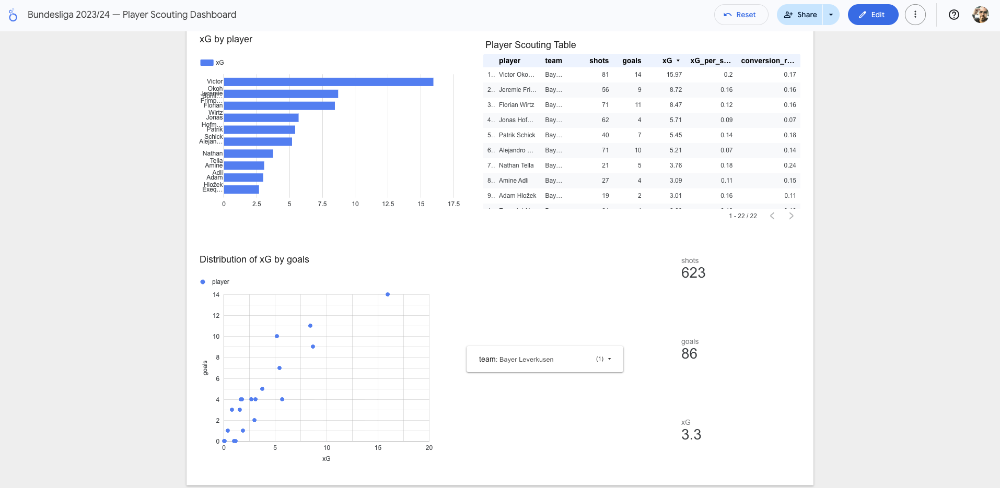

# Bundesliga 2023/24 — Player Scouting Dashboard

An interactive scouting dashboard built with StatsBomb open data, 
Python and Google Looker Studio.

---

## Live Dashboard

🔗 [View Interactive Dashboard](https://lookerstudio.google.com/reporting/325f601b-074d-46f9-97f3-6f08cb6dfcf9)



Filter by team to instantly see player rankings by xG, goals, 
shots and conversion rate.

---

## What it shows

- Top players by total xG across the season
- Goals vs xG distribution per player
- Full sortable scouting table with shots, goals, xG, xG per shot, conversion rate
- Filter by any Bundesliga team instantly

---

## Key findings — Bayer Leverkusen

- **Victor Boniface** led the league with 15.97 xG and 14 goals
- **Jeremie Frimpong** generated 8.72 xG from a fullback position — exceptional
- **Florian Wirtz** took 71 shots but at lower xG per shot (0.12) — shoots from distance
- **Nathan Tella** had the best conversion rate at 23.8%

---

## Tools & Data

- **Data:** StatsBomb open data (free)
- **Language:** Python 3.12
- **Libraries:** `statsbombpy`, `pandas`
- **Dashboard:** Google Looker Studio

---

## How to run
```bash
pip install statsbombpy pandas
python3 player_stats.py
```

This generates `bundesliga_player_stats.csv` which powers the dashboard.
